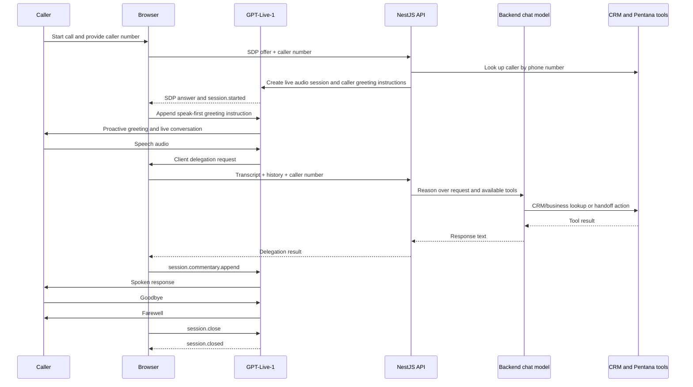

# GPT-Live voice agent architecture

This repository now uses OpenAI GPT-Live-1 for the voice conversation. The separate backend chat model handles dealership reasoning and calls CRM/business tools when GPT-Live delegates a request.

## Components

| Responsibility | Implementation |
| --- | --- |
| Browser UI and microphone | `public/index.html`, `public/app.js` |
| Real-time audio transport | Browser WebRTC peer connection to GPT-Live-1 |
| Voice model | `gpt-live-1`, configured in `src/openai/openai.service.ts` |
| Backend reasoning | OpenAI Chat Completions, configured by `OPENAI_REASONING_MODEL` (defaults to `gpt-4o-mini`) |
| Caller lookup and context | `VoiceAgentService` plus `CustomerDatabaseService` |
| Business data tools | `OpenAiService`: customer verification/lookup, staff availability, appointment-slot query, handoff record |

There is no Deepgram transcription, ElevenLabs speech generation, browser speech recognition, or NestJS voice WebSocket pipeline in this architecture. GPT-Live-1 owns live audio input and output. Backend delegation returns text to the Live session, which speaks it.

## Call flow

1. The browser requests microphone access and creates a WebRTC offer.
2. It posts the SDP offer and caller number to `POST /voice-agent/live/session`.
3. The server looks up the caller number and creates a `gpt-live-1` session with the matched or unknown-caller greeting instructions.
4. After `session.started`, the browser appends an instruction for GPT-Live-1 to speak first. Caller audio remains active while the opening is spoken.
5. GPT-Live-1 handles ordinary conversation. When dealership records or business actions are required, it creates a client delegation.
6. The browser sends the transcript, conversation history, and caller number to `POST /voice-agent/live/delegation`.
7. The backend chat model runs the existing prompt and tools, then the browser returns the result using `session.commentary.append` for GPT-Live-1 to speak.
8. If the caller says goodbye, the browser waits for the assistant's farewell audio to finish, sends `session.close`, and waits for `session.closed` before releasing the connection.

## Available backend tools

- `verifyPentanaCustomer`: match caller-provided name and vehicle registration to one customer record.
- `lookupPentanaCustomer`: retrieve customer, repair-order, parts, and booking data.
- `checkStaffAvailability`: check a named staff member.
- `queryAppointmentSlots`: return available service/test-drive slots; it does not reserve a slot.
- `createHandoffRecord`: log a callback or staff handoff.

The current backend does not create or confirm a service booking. The voice model must not tell callers that a booking is confirmed unless a booking tool is added and returns success.

## Caller identity

The UI currently supplies a caller number for local testing; this repository does not include PSTN/SIP integration to obtain ANI automatically. The server passes only a greeting and a known/unknown flag into the Live session. The backend separately resolves CRM context when processing a delegated request. Known callers are asked to confirm their identity before the model discusses personal details. Unknown callers hear the business and service introduction before being asked what they need.

## Debugging

Browser diagnostics appear in DevTools Console with the `[GPT-Live timestamp]` prefix. They include connection state, Live event types, transcript lengths, caller end-intent detection, delegation lifecycle, and session-close acknowledgments. They intentionally omit raw transcript content and caller numbers.

NestJS logs show Live session creation, delegation duration, and backend tool names/durations. A close attempt should show the outgoing `session.close` followed by `session.closed`. If the latter is absent, inspect the Live error events and browser connection state.

## Configuration

- `OPENAI_API_KEY`: server-side OpenAI API key used to create the Live session and run backend reasoning.
- `OPENAI_REASONING_MODEL`: backend chat model; defaults to `gpt-4o-mini`.
- `MONGO_URI`: MongoDB connection string used by the customer database module.

## OpenAI references

- [GPT-Live conversations and session lifecycle](https://developers.openai.com/api/docs/guides/live-conversations)
- [GPT-Live delegation and tools](https://developers.openai.com/api/docs/guides/live-delegation)
- [GPT-Live prompting](https://developers.openai.com/api/docs/guides/live-prompting)
- [WebRTC connection guide](https://developers.openai.com/api/docs/guides/voice-webrtc)
